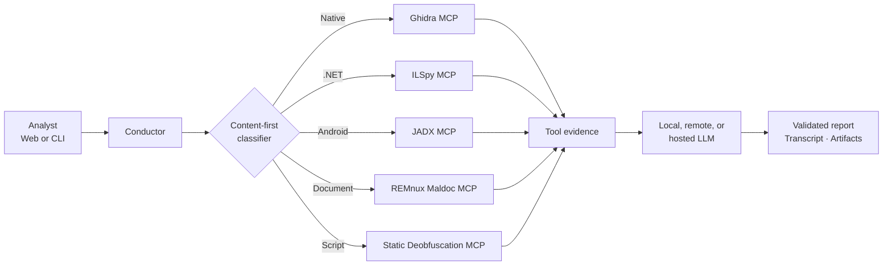

<div align="center">
  

  # REcluse

  **Evidence-first reverse-engineering triage for suspicious files**

  <p>
    <strong>RE</strong>cluse combines isolated reverse-engineering tools with an LLM analyst,<br>
    unraveling suspicious files into structured findings, traceable evidence, and recovered source.
  </p>

  
  
  
  
</div>

---

> [!CAUTION]
> REcluse is intended for trained malware analysts working in an appropriately isolated environment. Suspicious files remain dangerous even when archived. Do not expose the web interface publicly, mount untrusted samples outside the provided read-only workflow, or use the tool on systems containing sensitive data.

## What REcluse does

REcluse accepts an archive or individual file, identifies its real format from content rather than trusting its filename, and selects a purpose-built static-analysis playbook. Analyzer results are provided to an LLM, but final claims must cite successful tool calls before a report is accepted.

- **Content-first routing** — identifies PE, ELF, .NET, Android, Office, PDF, RTF, and script content using magic, package structure, and syntax signatures.
- **Isolated analyzers** — Docker containers run without networking, Linux capabilities, or writable access to the submitted sample.
- **Multiple playbooks** — Ghidra, ILSpy, JADX, REMnux document tooling, and a non-executing script deobfuscator.
- **Evidence-backed reports** — findings cite exact tool-call identifiers and retain rejection history and transcripts.
- **Script recovery** — statically unwraps common Base64, DEFLATE/GZip, character-code, escape, and concatenation obfuscation without invoking an interpreter.
- **Package-aware analysis** — prioritizes archive orchestrators, carries established context across members, safely decodes PEM-armored Base64 payloads, and analyzes decoded content with the correct route.
- **Optional dynamic correlation** — submits Windows PE/.NET samples to CAPE, ANY.RUN, Joe Sandbox, or Recorded Future Triage and correlates runtime behavior with static evidence.
- **Optional VirusTotal enrichment** — performs hash-first API v3 reputation lookup and can explicitly opt in to public upload for unknown samples.
- **Hash-first online pivots** — optional abuse.ch, UnpacMe, and Recorded Future Triage integrations search hashes before any permitted upload.
- **Local or remote models** — use Ollama on the analyst workstation, a remote inference server, or a supported hosted provider through LiteLLM.
- **Persistent analyst GUI** — drag-and-drop upload, queued jobs, live logs, per-file verdicts, decoded-payload viewers, persistent settings, and report deletion.
- **Searchable Report Archive** — filter persisted reports by filename, hash, date, model, and verdict; choose the number displayed and reopen complete analysis details.
- **CLI and REST automation** — use the same pipeline from the terminal or through the localhost FastAPI interface.

## Analysis routes

| Detected content | Analyzer | Representative capabilities |
|---|---|---|
| Native PE / ELF | Ghidra MCP | Imports, exports, strings, symbols, functions, callers, callees, decompilation |
| All supported file types | REMnux MCP | Deep file-aware tool chains, metadata, IOCs, strings, capabilities, signatures, unpacking hints, and analyst guidance |
| .NET assembly | ILSpy MCP | Managed assembly inspection and decompilation |
| Android APK / DEX | JADX MCP | Package, manifest, resource, and code inspection |
| Office / PDF / RTF | REMnux maldoc MCP | `olevba`, `oleid`, `oleobj`, `pdfid.py`, `pdf-parser.py`, `rtfobj`, metadata |
| PowerShell, JS, VBS, HTA, batch, shell, Python, and related scripts | Static script MCP | Bounded deobfuscation, recovered source, method log, capability analysis |

### Optional Windows dynamic analysis

REcluse can use a self-hosted [CAPE Sandbox](https://capev2.readthedocs.io/),
ANY.RUN, Joe Sandbox, or Recorded Future Triage as a second analysis stage for
Windows PE and .NET samples. CAPE runs the sample in a disposable Windows 10/11
virtual machine; it is not a Docker analyzer.
FLARE-VM may be installed in a separate analyst VM, but the automated detonation
guest should follow CAPE's guest configuration and snapshot workflow.

Dynamic analysis is disabled by default. Configure it in the Settings page or
in `config.json`:

```json
{
  "dynamic_enabled": true,
  "dynamic_providers": ["cape", "anyrun"],
  "dynamic_url": "http://127.0.0.1:8000",
  "dynamic_urls": {
    "cape": "http://127.0.0.1:8000",
    "joesandbox": "",
    "triage": "https://tria.ge/api/v0"
  },
  "dynamic_token": "",
  "dynamic_tokens": {
    "anyrun": "",
    "joesandbox": "",
    "triage": ""
  },
  "dynamic_timeout": 1800,
  "dynamic_poll_interval": 10,
  "dynamic_machine": "",
  "dynamic_package": "",
  "dynamic_allow_remote": false
}
```

One or more providers can be selected as defaults, and each WebGUI job can
override that selection under **Advanced options**. Selected providers run
concurrently; a failure or quota error from one provider does not discard
successful results from another. Multi-provider runs retain separate
`.dynamic.<provider>.json` artifacts.

Only localhost, IP-literal private, and explicitly private-suffixed CAPE
hostnames are accepted by default. To use a hosted service, store its credential
in the matching `dynamic_tokens` entry (the Settings page does this automatically)
and select it under **Advanced options**. Hosted support uses the vendors'
maintained `anyrun-sdk` and `jbxapi` packages. CAPE must provide its own isolated
malware network, automatic snapshot rollback, and an analysis-only Windows
guest; never attach that guest to a production or household network.

### Optional VirusTotal enrichment

VirusTotal enrichment is disabled by default. When enabled, REcluse first looks
up the sample's SHA-256 using the VirusTotal API v3. A hash lookup does not send
the file contents. Configure the feature from the Settings page or in
`config.json`:

```json
{
  "virustotal_enabled": true,
  "virustotal_api_key": "replace-with-vt-api-key",
  "virustotal_upload_missing": false,
  "virustotal_allow_upload": false,
  "virustotal_timeout": 300,
  "virustotal_poll_interval": 15
}
```

Unknown samples are not uploaded by default. Public upload requires both
`virustotal_upload_missing` and `virustotal_allow_upload`; enabling them
discloses the sample to VirusTotal and may make it available to VirusTotal
partners or community users. This is distinct from VirusTotal Private Scanning,
which requires a separate licensed API. The API key is write-only in the GUI,
omitted from job responses, and passed to the analysis process through an
environment variable.

In the WebGUI, upload is never a saved default. It is a secondary per-job
checkbox beneath the provider. Public/community-facing uploads open a warning
that requires the analyst to type `acknowledge`; the server independently
rejects the request without that acknowledgement. Hash lookups remain available
without uploading bytes.

### Triage, UnpacMe, and abuse.ch enrichment

Recorded Future Triage searches by SHA-256 before any optional submission.
UnpacMe requires an explicit upload choice for every analysis and requests a
private submission when configured and supported by the account. The abuse.ch
bundle correlates the SHA-256 against MalwareBazaar, ThreatFox, and URLhaus.
MalwareBazaar submission is intentionally not exposed: REcluse uses it only for
hash lookup because submitted samples are community-facing and its upload API is
intended for confirmed, fresh malware.

## Multi-file archives and decoded payloads

Archive members are not treated as unrelated jobs. REcluse analyzes likely
orchestrating scripts first, retains their bounded findings as package context,
and supplies those relationships to later member analyses. A package-level JSON
artifact records member statuses even when one member completes with warnings.

Files masquerading as certificates are handled conservatively. When a `.crt` or
similarly named file is actually PEM-armored Base64 data, REcluse decodes it as
an inert transformation, records the encoding and decoded SHA-256, saves the
decoded output, and routes that output from its content. For example, decoded
VBScript is sent to the static script analyzer and MSBuild XML is reviewed as
scriptable XML—not sent to Ghidra as a native executable. Decoded content is
never executed by this workflow.

The resulting report includes exact manual decoding instructions and specific
analyst pivots. In the WebGUI, decoded text opens in a safe viewer and retains a
separate download action.

Extensions are used only as a final hint. A PowerShell payload renamed to `.malz`, for example, is routed from its syntax rather than sent to a binary analyzer.

## Architecture



Each analyzer is launched with:

```text
--network none
--cap-drop ALL
--security-opt no-new-privileges
read-only sample mount
```

## Requirements

- Debian or Ubuntu-based analyst host
- Python 3 with virtual-environment support
- Docker
- 7-Zip
- Sufficient disk space for REMnux and analyzer images
- An LLM endpoint supported by [LiteLLM](https://docs.litellm.ai/)

The included setup script installs host dependencies, creates `venv/`, installs Python packages, and configures Docker:

```bash
git clone <your-repository-url>
cd REcluse
chmod +x scripts/setup.sh scripts/run-web recluse
./scripts/setup.sh
```

Setup preserves an existing Docker installation, including Docker CE installed
from Docker's upstream repository. On a host without Docker it installs Debian's
engine and CLI without optional Buildx packages; REcluse uses the Docker API and
does not require Buildx.

After setup, log out and back in if your current shell has not picked up membership in the `docker` group.

## Configuration

Copy the safe template before first use:

```bash
cp config/config.json.template config.json
```

`config.json` is intentionally ignored by Git because it can contain credentials.

### Local Ollama

```json
{
  "api_key": "",
  "api_base_url": "http://127.0.0.1:11434",
  "model": "ollama/mistral-nemo:12b"
}
```

### Remote Ollama

```json
{
  "api_key": "",
  "api_base_url": "http://inference-server.example:11434",
  "model": "ollama/mistral-nemo:12b"
}
```

### Hosted model

Use the provider/model identifier expected by LiteLLM and supply its credential. Provider-standard endpoints can generally leave `api_base_url` empty.

```json
{
  "api_key": "replace-with-provider-key",
  "api_base_url": "",
  "model": "openai/your-model"
}
```

You can also manage persistent defaults from the GUI's **Settings** page. Stored API keys are write-only from the browser's perspective: the interface reports whether a key exists but never reads it back.

## Web analyst console

Setup installs and starts the localhost-only WebGUI as a systemd service. Open
[http://127.0.0.1:8743](http://127.0.0.1:8743). Common service commands are:

```bash
systemctl status recluse-web.service
sudo systemctl restart recluse-web.service
journalctl -u recluse-web.service -f
```

For foreground development, stop the service and run `./scripts/run-web`. It uses port
8743 unless `RECLUSE_WEB_PORT` is set.

To override the service port, create a systemd drop-in with
`sudo systemctl edit recluse-web.service`, add an `[Service]` section containing
`Environment=RECLUSE_WEB_PORT=9876`, then run
`sudo systemctl daemon-reload` followed by
`sudo systemctl restart recluse-web.service`.

The interface provides:

- Drag-and-drop and filesystem upload
- Model, archive password, turn limit, and tool-error controls
- Optional API-key override and report-root selection
- Single-worker analysis queue to avoid competing for model/GPU resources
- Live Conductor output
- Persistent analysis history restored after WebGUI or host restarts
- Expandable per-file details with verdict badges and human-readable artifact tabs
- Safe inline viewing and explicit download controls for decoded payloads
- A searchable Report Archive with filename, hash, date, model, and verdict filters
- Configurable archive display counts of 15, 25, 50, 100, or all matching reports
- Navigation from an artifact back to the originating analysis details without losing archive filters
- Guarded deletion of finished analyses and their generated artifacts
- Persistent endpoint and default configuration

Choose another port without exposing the service beyond localhost:

```bash
RECLUSE_WEB_PORT=9876 ./scripts/run-web
```

### FastAPI integration

The console also exposes a local REST API. Interactive OpenAPI documentation is
available at [http://127.0.0.1:8743/api/docs](http://127.0.0.1:8743/api/docs),
and the raw schema is available at `/api/openapi.json`.

Check readiness and submit a sample using the configured analysis defaults:

```bash
curl http://127.0.0.1:8743/api/health

curl -sS -X POST http://127.0.0.1:8743/api/jobs \
  -F 'sample=@suspicious-file.7z' \
  -F 'password=infected'
```

The submission returns HTTP `202` and a job object containing its `id`. Poll the
job until `status` is `completed`, `completed_with_warnings`, or `failed`:

```bash
curl -sS http://127.0.0.1:8743/api/jobs/JOB_ID
```

Completed jobs list their artifacts. Retrieve raw JSON or text content without
the browser viewer redirect:

```bash
curl -o artifact.json \
  http://127.0.0.1:8743/api/jobs/JOB_ID/artifact-content/ARTIFACT_PATH
```

Optional multipart fields include `model`, `api_key`, `reports_dir`,
`max_turns`, `max_tool_errors`, and `verbose`. Omitted fields use the persistent
defaults configured in the GUI. The API intentionally binds to localhost by
default and has no authentication; do not expose it to an untrusted network.

Useful endpoints include:

| Method | Endpoint | Purpose |
|---|---|---|
| `GET` | `/api/health` | Check service readiness |
| `GET` | `/api/config` | Read non-secret defaults and feature availability |
| `GET` / `PUT` | `/api/settings` | Read or update settings; stored secrets are never returned |
| `POST` | `/api/jobs` | Submit one sample or archive for analysis |
| `GET` | `/api/jobs` | List persisted jobs |
| `GET` | `/api/jobs/{job_id}` | Poll status, logs, parameters, and artifacts |
| `DELETE` | `/api/jobs/{job_id}` | Delete a finished job and its managed artifacts |
| `GET` | `/api/reports` | Search reports by filename, hash, date, model, and verdict |
| `GET` | `/api/jobs/{job_id}/artifact-content/{path}` | Read a text or JSON artifact inline |
| `GET` | `/api/jobs/{job_id}/artifacts/{path}` | Download an artifact |

Provider selections and upload authorizations are also available as multipart
fields. Consult `/api/docs` for the current schema. Public or community-facing
sample uploads require the literal `upload_acknowledgement=acknowledge`; hash
lookups do not.

## Command-line usage

```bash
./recluse suspicious-file.7z
```

Common overrides:

```bash
./recluse suspicious-file.7z \
  --password infected \
  --model ollama/mistral-nemo:12b \
  --reports-dir reports \
  --max-turns 20 \
  --max-tool-errors 5 \
  --verbose
```

Broad REMnux enrichment is enabled by default and uses the official MCP server's
Scenario 1 Docker connector. Each payload is copied into a fresh offline REMnux
container; the host-side connector uses stdio and is sandboxed to that job's
staging directory. Select a faster tier or disable it when resources are tight:

```bash
./recluse suspicious-file.7z --remnux-depth standard
./recluse suspicious-file.7z --no-remnux
```

VirusTotal can be enabled per CLI run. The API key can be stored in
`config.json`, supplied with `--virustotal-api-key`, or set in
`RECLUSE_VIRUSTOTAL_API_KEY`:

```bash
RECLUSE_VIRUSTOTAL_API_KEY='…' \
  ./recluse suspicious-file.7z --virustotal

# Explicitly disclose and upload only when the hash is unknown:
./recluse suspicious-file.7z \
  --virustotal \
  --virustotal-upload-missing \
  --virustotal-allow-upload
```

CAPE summaries exclude a small default set of recurring Windows VM baseline
network indicators from verdict scoring. The complete CAPE JSON is never
modified. To replace the defaults with a baseline captured from your own VM,
set `cape_noise_domains` and `cape_noise_ips` in `config.json`:

```json
{
  "cape_noise_domains": ["cdn.onenote.net"],
  "cape_noise_ips": ["40.90.64.229"]
}
```

View every option:

```bash
./recluse --help
```

## Output

For each analyzed member, REcluse can produce:

```text
<sample>.report.json
<sample>.transcript.json
<sample>.deobfuscated.txt   # when script obfuscation is recovered
<sample>.decoded.<type>     # inert decoded content when a wrapper is recognized
<sample>.dynamic.<provider>.json # sandbox report when enabled and completed
<sample>.remnux.json        # full REMnux MCP tool-chain results
<sample>.virustotal.json    # full VT API response when a report is available
<sample>.abusech.json       # optional hash-correlation results
<sample>.unpacme.json       # optional unpacking-service results
<archive>.package.json      # package status and shared member context
```

Reports include sample hashes, detected file type, identification method, selected route, completion status, model, tool evidence, validation failures, quality scoring, verdict, capabilities, IOCs, and exact evidence references.

Submitted samples and generated reports are excluded by `.gitignore`. Keep those artifacts in an access-controlled case-management location rather than source control.

The ignored `Resources/` directory is available for disposable analyst test
scripts and sample material. Automated `tests/test_*.py` regression tests remain
tracked because they are project source. `config.json`, `.env` files, report
directories, uploads, decoded outputs, and WebGUI job manifests are also
ignored to reduce the risk of committing credentials or case evidence.

## Safety model

REcluse reduces risk; it does not make malware harmless.

- Samples are mounted read-only in disposable containers.
- Analyzer containers have no network access.
- Script analysis performs text/data transformations and never calls PowerShell, WScript, Node, Python, Bash, `eval`, or an emulator on submitted source.
- Archive paths are validated against traversal and symlink attacks.
- Report artifacts are written atomically.
- The GUI binds to `127.0.0.1` and confines artifact downloads to their job directory.
- LLM responses are rejected when evidence refers to unknown tool calls.

For remote model use, remember that tool output and recovered source may be sent to the configured provider. Review your organization's handling requirements before analyzing sensitive samples with a third-party service.

## Project layout

```text
conductor.py              Orchestration, routing, validation, and reporting
webapp.py                 Local FastAPI analyst console
web/                      Browser interface and REcluse branding
cape_client.py            CAPE API client and report normalization
sandbox_client.py         Dynamic sandbox provider abstraction
virustotal_client.py      VirusTotal lookup and optional upload client
online_enrichment.py      abuse.ch and UnpacMe integrations
recluse                   CLI launcher
containers/               Analyzer images, MCP servers, and build helpers
scripts/                  Host bootstrap and WebGUI launcher
systemd/                  Localhost service template
config/                   Safe configuration example
Resources/                Ignored analyst test scripts and samples
tests/                    Tracked regression tests
```

## Responsible use

Use REcluse only on files and systems you are authorized to investigate. Keep the host, Docker daemon, model endpoint, uploaded samples, and resulting intelligence protected according to your organization's malware-handling policies.

---

<div align="center">
  <sub><strong>RE</strong>cluse — unravel the behavior, preserve the evidence.</sub>
</div>
