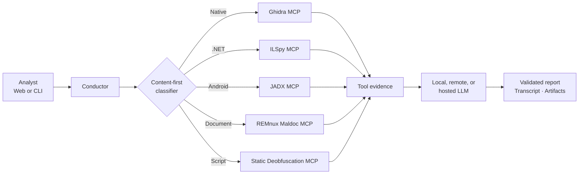

<div align="center">
  

  # REcluse

  **Evidence-first reverse-engineering triage for suspicious files**

  <p>
    <strong>RE</strong>cluse combines isolated reverse-engineering tools with an LLM analyst,<br>
    unraveling suspicious files into structured findings, traceable evidence, and recovered source.
  </p>

  
  
  
  
</div>

---

> [!CAUTION]
> REcluse is intended for trained malware analysts working in an appropriately isolated environment. Suspicious files remain dangerous even when archived. Do not expose the web interface publicly, mount untrusted samples outside the provided read-only workflow, or use the tool on systems containing sensitive data.

## What REcluse does

REcluse accepts an archive or individual file, identifies its real format from content rather than trusting its filename, and selects a purpose-built static-analysis playbook. Analyzer results are provided to an LLM, but final claims must cite successful tool calls before a report is accepted.

- **Content-first routing** — identifies PE, ELF, .NET, Android, Office, PDF, RTF, and script content using magic, package structure, and syntax signatures.
- **Isolated analyzers** — Docker containers run without networking, Linux capabilities, or writable access to the submitted sample.
- **Multiple playbooks** — Ghidra, ILSpy, JADX, REMnux document tooling, and a non-executing script deobfuscator.
- **Evidence-backed reports** — findings cite exact tool-call identifiers and retain rejection history and transcripts.
- **Script recovery** — statically unwraps common Base64, DEFLATE/GZip, character-code, escape, and concatenation obfuscation without invoking an interpreter.
- **Local or remote models** — use Ollama on the analyst workstation, a remote inference server, or a supported hosted provider through LiteLLM.
- **Analyst-friendly GUI** — drag-and-drop upload, parameter controls, queued jobs, live logs, persistent settings, and downloadable artifacts.
- **CLI automation** — the same pipeline remains available for terminal and batch workflows.

## Analysis routes

| Detected content | Analyzer | Representative capabilities |
|---|---|---|
| Native PE / ELF | Ghidra MCP | Imports, exports, strings, symbols, functions, callers, callees, decompilation |
| .NET assembly | ILSpy MCP | Managed assembly inspection and decompilation |
| Android APK / DEX | JADX MCP | Package, manifest, resource, and code inspection |
| Office / PDF / RTF | REMnux maldoc MCP | `olevba`, `oleid`, `oleobj`, `pdfid.py`, `pdf-parser.py`, `rtfobj`, metadata |
| PowerShell, JS, VBS, HTA, batch, shell, Python, and related scripts | Static script MCP | Bounded deobfuscation, recovered source, method log, capability analysis |

Extensions are used only as a final hint. A PowerShell payload renamed to `.malz`, for example, is routed from its syntax rather than sent to a binary analyzer.

## Architecture



Each analyzer is launched with:

```text
--network none
--cap-drop ALL
--security-opt no-new-privileges
read-only sample mount
```

## Requirements

- Debian or Ubuntu-based analyst host
- Python 3 with virtual-environment support
- Docker
- 7-Zip
- Sufficient disk space for REMnux and analyzer images
- An LLM endpoint supported by [LiteLLM](https://docs.litellm.ai/)

The included setup script installs host dependencies, creates `venv/`, installs Python packages, and configures Docker:

```bash
git clone <your-repository-url>
cd REcluse
chmod +x setup.sh recluse run-web
./setup.sh
```

After setup, log out and back in if your current shell has not picked up membership in the `docker` group.

## Configuration

Copy the safe template before first use:

```bash
cp config.json.template config.json
```

`config.json` is intentionally ignored by Git because it can contain credentials.

### Local Ollama

```json
{
  "api_key": "",
  "api_base_url": "http://127.0.0.1:11434",
  "model": "ollama/mistral-nemo:12b"
}
```

### Remote Ollama

```json
{
  "api_key": "",
  "api_base_url": "http://inference-server.example:11434",
  "model": "ollama/mistral-nemo:12b"
}
```

### Hosted model

Use the provider/model identifier expected by LiteLLM and supply its credential. Provider-standard endpoints can generally leave `api_base_url` empty.

```json
{
  "api_key": "replace-with-provider-key",
  "api_base_url": "",
  "model": "openai/your-model"
}
```

You can also manage persistent defaults from the GUI's **Settings** page. Stored API keys are write-only from the browser's perspective: the interface reports whether a key exists but never reads it back.

## Web analyst console

Start the localhost-only web application:

```bash
./run-web
```

Then open [http://127.0.0.1:8080](http://127.0.0.1:8080).

The interface provides:

- Drag-and-drop and filesystem upload
- Model, archive password, turn limit, and tool-error controls
- Optional API-key override and report-root selection
- Single-worker analysis queue to avoid competing for model/GPU resources
- Live Conductor output
- Downloadable reports, transcripts, and recovered scripts
- Persistent endpoint and default configuration

Choose another port without exposing the service beyond localhost:

```bash
RECLUSE_WEB_PORT=8090 ./run-web
```

## Command-line usage

```bash
./recluse suspicious-file.7z
```

Common overrides:

```bash
./recluse suspicious-file.7z \
  --password infected \
  --model ollama/mistral-nemo:12b \
  --reports-dir reports \
  --max-turns 20 \
  --max-tool-errors 5 \
  --verbose
```

View every option:

```bash
./recluse --help
```

## Output

For each analyzed member, REcluse can produce:

```text
<sample>.report.json
<sample>.transcript.json
<sample>.deobfuscated.txt   # when script obfuscation is recovered
```

Reports include sample hashes, detected file type, identification method, selected route, completion status, model, tool evidence, validation failures, quality scoring, verdict, capabilities, IOCs, and exact evidence references.

Submitted samples and generated reports are excluded by `.gitignore`. Keep those artifacts in an access-controlled case-management location rather than source control.

## Safety model

REcluse reduces risk; it does not make malware harmless.

- Samples are mounted read-only in disposable containers.
- Analyzer containers have no network access.
- Script analysis performs text/data transformations and never calls PowerShell, WScript, Node, Python, Bash, `eval`, or an emulator on submitted source.
- Archive paths are validated against traversal and symlink attacks.
- Report artifacts are written atomically.
- The GUI binds to `127.0.0.1` and confines artifact downloads to their job directory.
- LLM responses are rejected when evidence refers to unknown tool calls.

For remote model use, remember that tool output and recovered source may be sent to the configured provider. Review your organization's handling requirements before analyzing sensitive samples with a third-party service.

## Project layout

```text
conductor.py              Orchestration, routing, validation, and reporting
webapp.py                 Local FastAPI analyst console
web/                      Browser interface and REcluse branding
maldoc_mcp_server.py      Static malicious-document tools
script_mcp_server.py      Non-executing script deobfuscation tools
Dockerfile.ghidra         Native reverse-engineering image
Dockerfile.ilspy          .NET reverse-engineering image
Dockerfile.jadx           Android reverse-engineering image
Dockerfile.maldoc         REMnux document-analysis image
Dockerfile.script         Static script-analysis image
recluse                   CLI launcher
run-web                   Web launcher
setup.sh                  Host bootstrap
config.json.template      Safe configuration example
```

## Responsible use

Use REcluse only on files and systems you are authorized to investigate. Keep the host, Docker daemon, model endpoint, uploaded samples, and resulting intelligence protected according to your organization's malware-handling policies.

---

<div align="center">
  <sub><strong>RE</strong>cluse — unravel the behavior, preserve the evidence.</sub>
</div>
